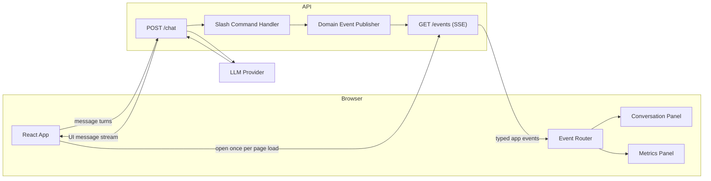
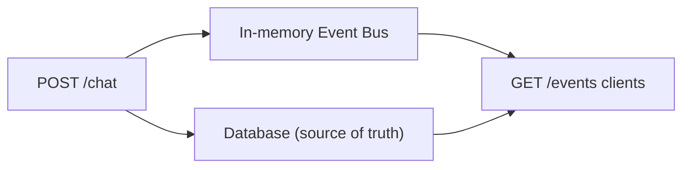
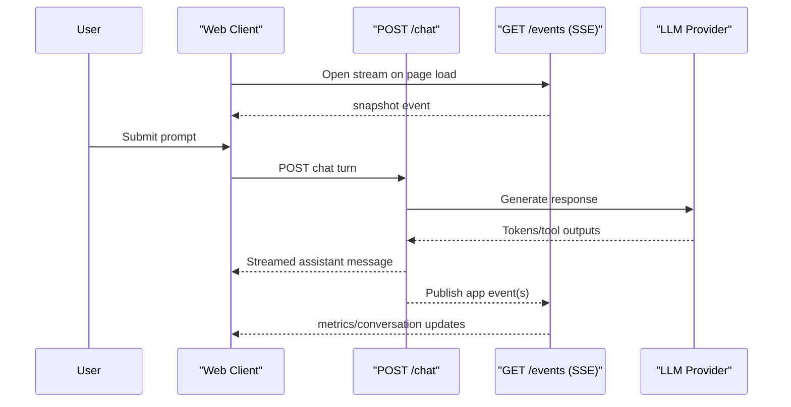
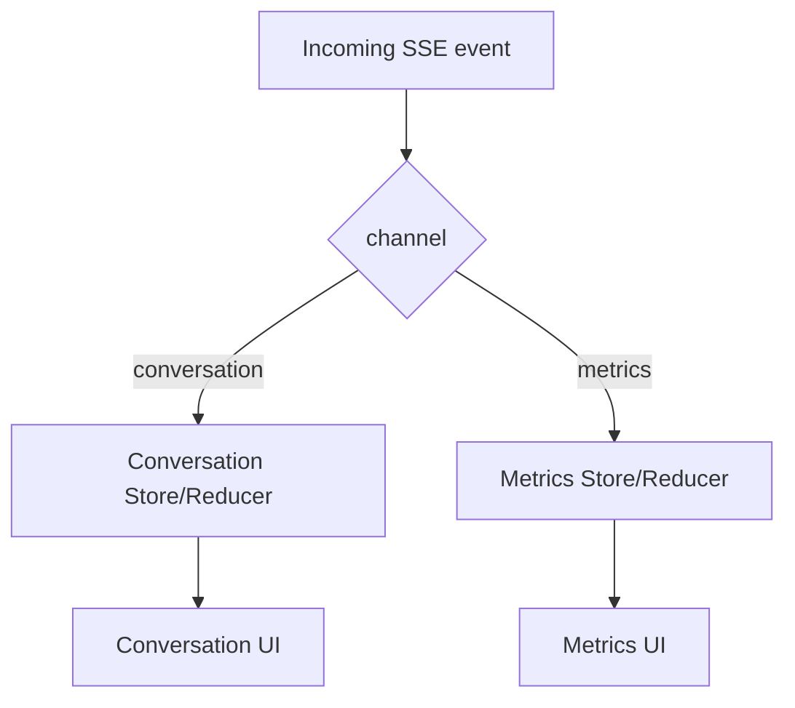

# Chat-Driven UI Architecture (High-Level)

## Goal

Keep the app chat-first while allowing non-chat UI updates (like metric cards) with minimal coupling.

## Core Shape

- One write endpoint: `POST /chat`
- One read stream: `GET /events` (SSE)
- Client routes streamed app events to panel-specific state (`Conversation`, `Metrics`)

This keeps chat transport simple while letting the backend push UI-intent events independently.

## Runtime Topology



## Endpoint Responsibilities

### `POST /chat`

- Accepts user message turns
- Handles chat logic (LLM call, slash command interception, tool execution)
- Streams assistant responses back to the chat UI transport
- Can emit side effects as app events (for `/events`) when needed

### `GET /events` (SSE)

- Long-lived server-to-client stream
- First event should be a snapshot of current app-visible state
- Subsequent events are incremental updates
- Intended for panel updates and notices, not primary token streaming

## Delivery Model (MVP)

For now, use a small in-process event bus. Do not treat the event stream itself as a durable source of truth.

- Source of truth remains the database (users, metrics, onboarding state, etc.)
- `/events` is a delivery channel for near-real-time UI updates
- On new SSE connection, send a snapshot built from DB reads
- During `POST /chat`, after domain changes are written, publish events to the in-memory bus



This provides a simple and robust baseline:

- If an event is missed, reconnect + snapshot restores UI state
- No replay log is required for initial implementation

### When to Add Durable Event Storage

Add persistence for events only when needed (not by default):

- Multi-instance API deployment requires cross-instance fan-out
- You need resume/replay semantics beyond reconnect + snapshot
- You need audit/history guarantees for emitted UI events

At that point, back the bus with a durable stream/outbox (for example: Redis Streams, Postgres outbox, NATS, Kafka).

## Event Contract (Recommended)

Send JSON in SSE `data:` using a single envelope:

```json
{
  "id": "evt_123",
  "channel": "conversation",
  "type": "notice",
  "createdAt": "2026-02-12T08:30:00Z",
  "payload": {}
}
```

Suggested `channel` values:

- `conversation`
- `metrics`

Suggested `type` examples:

- `snapshot`
- `conversation.notice`
- `conversation.system_message`
- `metrics.upsert`
- `metrics.remove`

## Client Flow



## Event Routing in the UI



## Why This Split

- Keeps `useChat` and chat streaming behavior straightforward
- Avoids mixing all UI state into chat transcript state
- Supports future actions like metric preview/commit without changing core chat transport
- Lets each panel update independently while sharing one stream

## Example Use Cases (Non-Exhaustive)

- Show a conversation notice (for example, guidance to run a command)
- Add/update/remove metric cards without forcing a chat response
- Surface backend system notices even when no prompt is submitted
