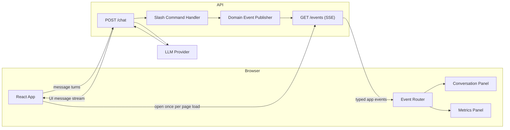
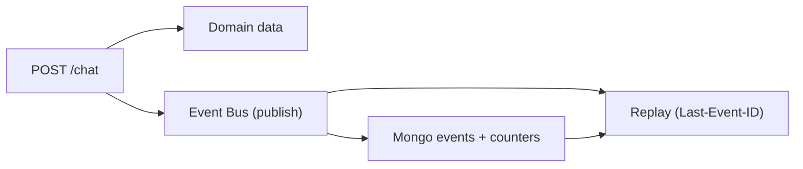
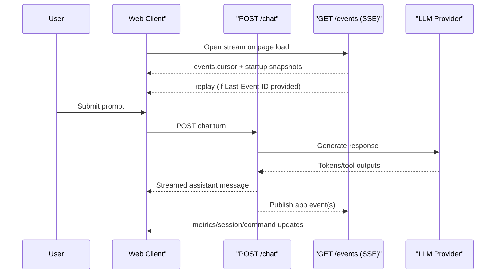
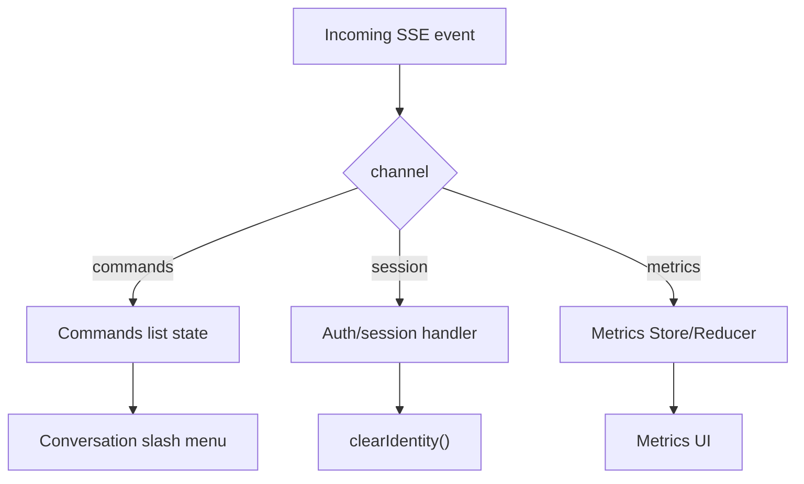

# Chat-Driven UI Architecture (High-Level)

## Goal

Keep the app chat-first while allowing non-chat UI updates (like metric cards) with minimal coupling.

## Core Shape

- One write endpoint: `POST /chat`
- One read stream: `GET /events` (SSE)
- Client routes streamed app events to panel-specific state (`Conversation`, `Metrics`)

This keeps chat transport simple while letting the backend push UI-intent events independently.

## Runtime Topology



## Endpoint Responsibilities

### `POST /chat`

- Accepts user message turns
- Handles chat logic (LLM call, slash command interception, tool execution)
- Streams assistant responses back to the chat UI transport
- Can emit side effects as app events (for `/events`) when needed

### `GET /events` (SSE)

- Long-lived server-to-client stream
- On first connect (no `Last-Event-ID`), emits `events.cursor` with the current sequence as SSE `id`
- Sends startup snapshots without SSE `id` (currently `metrics.upsert` + `commands.snapshot`)
- Replays persisted events where `seq > Last-Event-ID` when reconnecting
- Streams live bus events with SSE `id` set to `seq`
- Intended for panel updates and notices, not primary token streaming
- Includes heartbeat comments to keep long-lived connections healthy

## Delivery Model (Current)

The event bus is Mongo-backed for durability and still uses in-memory pub/sub for low-latency fan-out.

- Source of truth for domain data remains the primary DB collections
- `publish()` assigns a monotonic `seq`, persists to `events`, then fans out to subscribers
- `/events` combines startup snapshots + DB replay + live in-memory fan-out
- Startup snapshots are regenerated on each connection and are not replayed from storage



Reconnect behavior:

- First connect: server emits `events.cursor` at the current boundary before snapshot events
- Reconnect: browser sends `Last-Event-ID`; server replays missed events from Mongo
- Live events continue from in-memory fan-out after replay

## Event Contract (Current)

Send JSON in SSE `data:` using a single envelope:

```json
{
  "id": "a2c0f15d-f31d-4c9f-8f5d-2810af4ca7f2",
  "channel": "session",
  "type": "session.logout",
  "payload": {},
  "sentAt": "2026-02-12T08:30:00Z",
  "seq": 42
}
```

`seq` is present on persisted/replayed bus events and is also emitted as the SSE `id`. Snapshot events are sent without SSE `id`.

Current `channel` values:

- `events`
- `commands`
- `session`
- `metrics`

Current `type` examples:

- `events.cursor`
- `commands.snapshot`
- `session.logout`
- `metrics.upsert`

## Client Flow



## Event Routing in the UI



## Why This Split

- Keeps `useChat` and chat streaming behavior straightforward
- Avoids mixing all UI state into chat transcript state
- Supports future actions like metric preview/commit without changing core chat transport
- Lets each panel update independently while sharing one stream

## Example Use Cases (Non-Exhaustive)

- Show a conversation notice (for example, guidance to run a command)
- Add/update/remove metric cards without forcing a chat response
- Surface backend system notices even when no prompt is submitted
