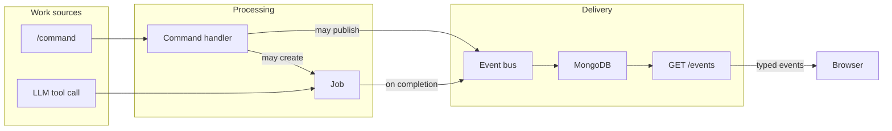
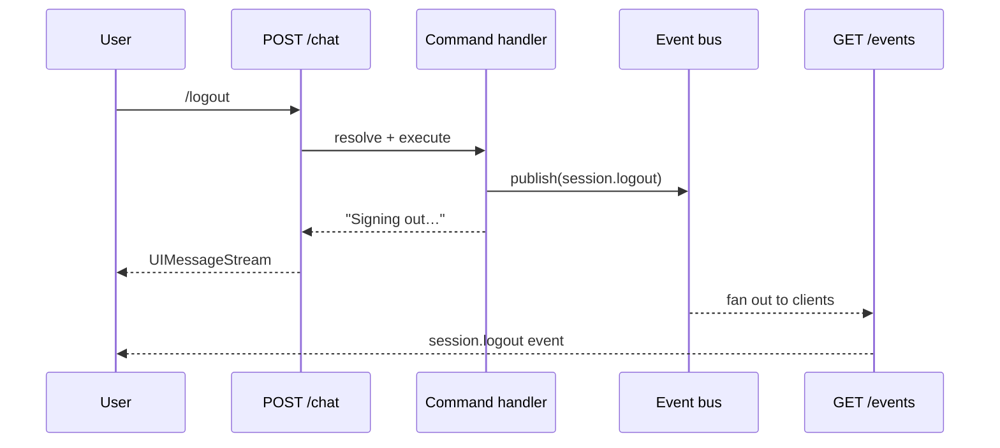

# Commands, Jobs & Events

This document defines the three core concepts that drive side effects in Flowly and describes how they fit together today and as the system evolves.

## Concepts

### Commands

A **command** is a user-initiated action triggered by typing `/name` in the chat input. Commands are synchronous, lightweight, and always produce an immediate chat response. They may also create jobs or publish events as side effects.

Commands are the _only_ concept that maps to the slash command UI (autocomplete menu, `POST /chat` interception, `commands.snapshot` discovery). See [slash-commands.md](./slash-commands.md) for implementation details.

### Jobs

A **job** is a unit of work that needs to be processed. Jobs are created by commands or by the LLM (via tool calls) and may be short-lived or long-running.

Jobs are the abstraction that decouples "something needs to happen" from "how and when it happens." Today, work happens inline. In the future, a worker process will poll for pending jobs and execute them independently of the HTTP request lifecycle.

### Events

An **event** is a fact about something that happened. Events flow from the backend to the frontend via the SSE stream (`GET /events`) and drive UI updates. Events are the _only_ mechanism for pushing state changes to the client — there is no polling or refetching.

## How they relate



## Current state (v1)

Commands execute inline and publish events directly. There is no job queue yet — the command handler _is_ the processor. Events are published to an in-memory bus which fans out to SSE connections.



### Limitations of v1

- **No durability.** Events exist only in memory. If the SSE connection drops and reconnects, events published during the gap are lost.
- **No async processing.** All work happens inside the HTTP request. Long-running operations would block the response.
- **Single source.** Only slash commands can trigger side effects. The LLM cannot create jobs.

## Target state (v2)

MongoDB backs the event bus, providing persistence and SSE replay. Commands and LLM tool calls both create jobs. A worker process handles job execution asynchronously.


### What v2 adds

- **Durable events.** Events are persisted to MongoDB with a monotonic sequence number. The SSE endpoint replays missed events on reconnect using the standard `Last-Event-ID` header.
- **Async job processing.** A worker polls MongoDB for pending jobs, executes them, and publishes completion events. The HTTP request returns immediately.
- **Multiple work sources.** Both slash commands and LLM tool calls can create jobs in the same queue.

## Data model

### Event (exists today)

```
events collection
─────────────────
_id      : string (UUID)
seq      : number (monotonic, assigned at publish time)
channel  : string (e.g. "session", "metrics", "commands")
type     : string (e.g. "session.logout", "metrics.upsert")
payload  : object
sentAt   : string (ISO 8601)
storedAt : Date   (for TTL expiry)
```

`seq` is the SSE event ID. On reconnect, the client sends `Last-Event-ID: <seq>` and the server replays all events with `seq > lastSeq`.

A TTL index on `storedAt` (24h) prevents unbounded growth.

### Job (future)

```
jobs collection
───────────────
_id       : string (UUID)
type      : string (e.g. "logout", "update-budget")
source    : "command" | "tool"
args      : object
status    : "pending" | "processing" | "completed" | "failed"
result    : object | null
createdAt : Date
updatedAt : Date
```

Jobs are created by command handlers or LLM tool call handlers. The worker polls for `status: "pending"`, transitions to `"processing"`, executes, then marks `"completed"` or `"failed"` and publishes the corresponding event.

## Migration path

The system evolves incrementally. Each step is independently shippable.


| Step | What changes | What stays the same |
|------|-------------|---------------------|
| **v1 → v1.1** | Events persisted to MongoDB. SSE replays on reconnect. `publish()` becomes async. | Commands still execute inline. No worker. No jobs collection. |
| **v1.1 → v2** | Jobs collection added. Worker process polls and executes. Commands create jobs instead of executing inline. LLM tool calls create jobs. | Event persistence and SSE replay unchanged. Event bus fan-out unchanged. |

## Naming conventions

| Concept | Scope | Examples |
|---------|-------|---------|
| **Command** | User-initiated slash command | `/logout`, `/help`, `/budget` |
| **Job** | Async unit of work (any source) | logout, update-budget, generate-report |
| **Event** | Fact about something that happened | `session.logout`, `metrics.upsert`, `job.completed` |

Commands are always user-facing (they appear in the autocomplete menu). Jobs are internal (the user doesn't see them directly). Events are the delivery mechanism that bridges backend processing to frontend UI updates.
