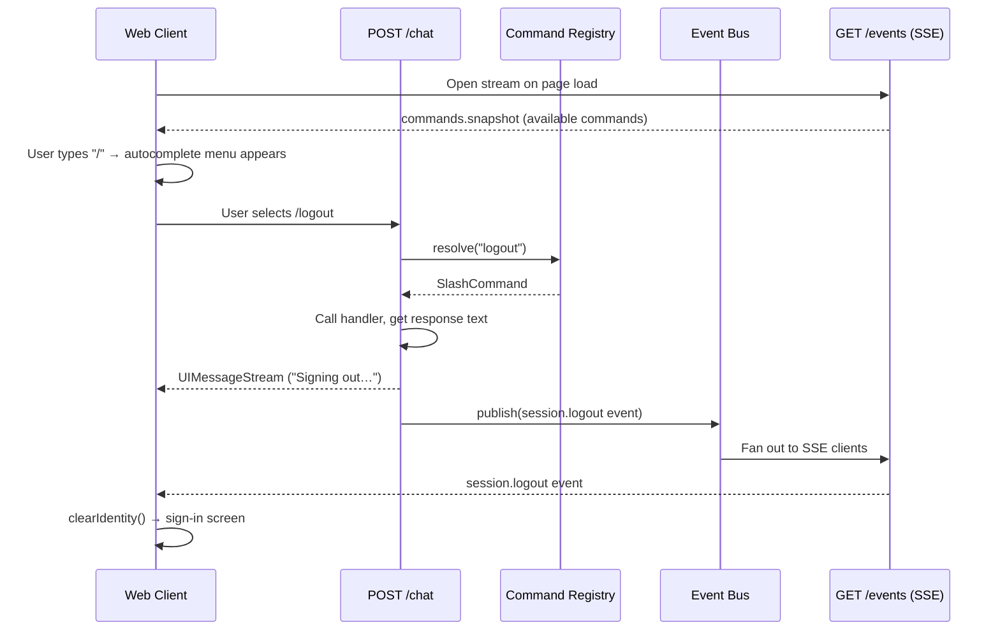

# Slash Commands

Slash commands let users trigger actions by typing `/command` in the chat input. Commands are registered on the backend and discovered by the frontend at runtime.

## Architecture



### Key design decisions

- **Backend is the source of truth.** Commands are registered in the API, and the frontend discovers them via a `commands.snapshot` SSE event on connection. No command list is hardcoded on the frontend.
- **Commands are intercepted before the LLM.** When `POST /chat` receives a message starting with `/`, it checks the registry before routing to the language model. If a command matches, the LLM is skipped entirely.
- **Responses use the ai-sdk streaming protocol.** Command responses are returned via `createUIMessageStreamResponse`, so they render as normal assistant messages in the chat.
- **Side effects flow through the event bus.** Commands that need to trigger client-side behavior (like logout) publish events to the bus, which fans out to all SSE connections.

### Why an interface, not an abstract class

Each command implements the `SlashCommand` type — a plain TypeScript interface with `name`, `description`, and `handler`. This was a deliberate choice:

- **Commands are currently independent.** Each handler is a self-contained function with no shared behavior to inherit. An abstract class would add ceremony without providing value.
- **The type system enforces the contract.** TypeScript checks the shape at compile time — a handler that forgets `name` or returns the wrong type won't compile.
- **Registration is explicit.** Commands call `register()` at module load time rather than relying on class instantiation or decorators.

If commands later need shared behavior (argument parsing, permission checks, error wrapping), promoting `SlashCommand` to an abstract class with base methods would be the natural evolution. Until then, the interface keeps things minimal.

## Adding a new command

### 1. Create a command file

Create a new file in `api/src/slash/commands/`:

```typescript
// api/src/slash/commands/help.ts
import { register } from "../registry";

register({
  name: "help",
  description: "Show available commands",
  handler(args) {
    // args contains everything after "/help "
    return "Available commands: /logout, /help";
  },
});
```

The `handler` function receives the argument string (text after the command name) and returns the response text that will be shown as an assistant message. Handlers may be `async` if they need to perform side effects like publishing events.

### 2. Import it in the barrel file

```typescript
// api/src/slash/index.ts
import "./commands/logout";
import "./commands/help";    // ← add this

export { list, resolve } from "./registry";
```

The import triggers `register()` at startup. The command will automatically:
- Appear in the `commands.snapshot` SSE event sent to clients
- Be available in the chat autocomplete menu
- Be handled when submitted via `POST /chat`

### 3. (Optional) Publish a side-effect event

If the command needs to trigger client-side behavior beyond the chat response, publish an event:

```typescript
import { publish } from "../../events/bus";
import { register } from "../registry";

register({
  name: "clear",
  description: "Clear the dashboard",
  async handler() {
    await publish({
      id: crypto.randomUUID(),
      channel: "dashboard",
      type: "dashboard.clear",
      payload: {},
      sentAt: new Date().toISOString(),
    });
    return "Dashboard cleared.";
  },
});
```

Then add a corresponding event type guard on the frontend (`web/src/components/layout/events.ts`) and handle it in the appropriate component.

## Command registry API

Located in `api/src/slash/registry.ts`:

| Function | Signature | Description |
|----------|-----------|-------------|
| `register` | `(command: SlashCommand) => void` | Register a command |
| `resolve` | `(name: string) => SlashCommand \| undefined` | Look up a command by name |
| `list` | `() => SlashCommandInfo[]` | List all commands (name + description, no handlers) |

### Types

```typescript
type SlashCommand = {
  name: string;
  description: string;
  handler: (args: string) => string | Promise<string>;
};

type SlashCommandInfo = {
  name: string;
  description: string;
};
```

## Frontend autocomplete

The autocomplete menu appears when the user types `/` in the chat input. It uses [cmdk](https://cmdk.paco.me/) under the hood via the `PromptInputCommand*` components from `ai-elements`.

- Commands are received from the `commands.snapshot` SSE event and stored in component state
- cmdk handles keyboard navigation and filtering as the user types
- Selecting a command submits it immediately

## Testing

Tests live in `{package}/tests/` mirroring the `src/` structure:

```
api/tests/
├── slash/
│   └── registry.test.ts    # Registry register/resolve/list
├── events/
│   ├── bus.test.ts          # Pub/sub event bus
│   └── store.test.ts        # Event store persistence
├── db/
│   └── client.test.ts       # MongoDB connection
└── http/chat/
    └── commands.test.ts     # Slash command parsing + handling

web/tests/
└── components/layout/
    ├── events.test.ts               # Event type guards
    └── SlashCommandMenu.test.tsx    # Autocomplete menu rendering
```

Run all tests: `bun run test`
